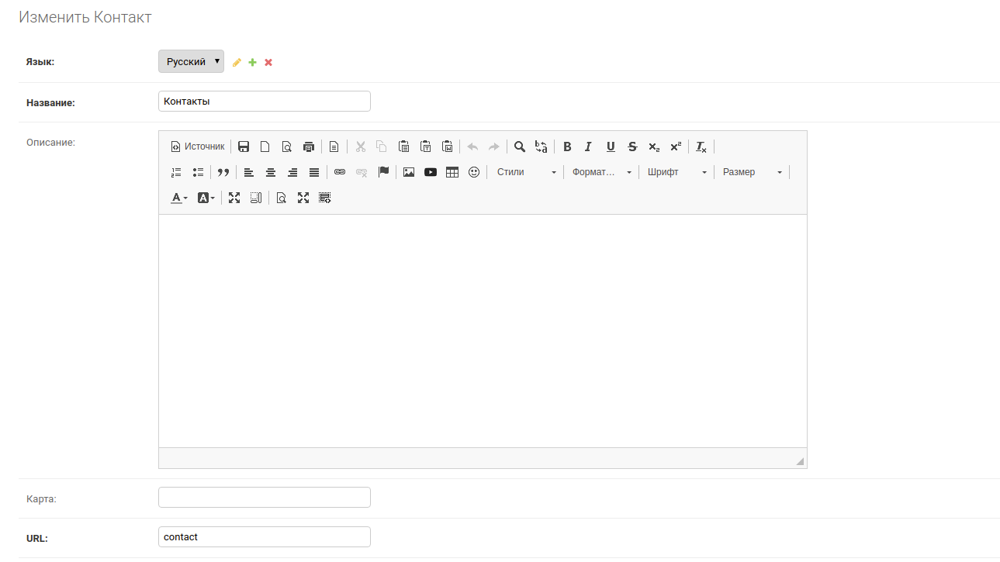
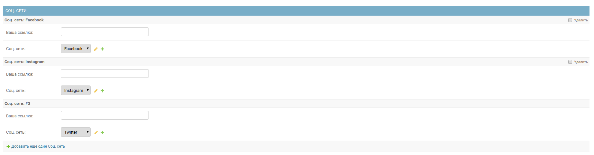

Контакты
========

.. image:: ../_static/contact_soc.png
Template tags
-------------

    Подключение тега. Если не указать шаблон, то будет взят по умолчанию.
    Если не указан name будут выбраны все записи контактов.

    .. code-block:: python

       

       

    Изменение шаблона

    .. code-block:: python

       

    Шаблон для вывода полей контактов и соц. сетей.

    .. code-block:: python

        
{{ contact.name }}

            '''Поля контактов'''
        
            

                
                        '''Иконка'''
                    
                
                        '''Загруженая иконка'''
                    
                
                    '''Поле 1'''
                {{ field.text|safe }}
                    '''Поле 2'''
                {{ field.text_two|safe }}
            

        
            '''Соц. ссылки'''
        
            

                <a href="{{ link_soc.get_link_contact_soc }}">
                    
                            '''Иконка'''
                        
                    
                            '''Загруженая иконка'''
                        
                    
                           ''' Название, если нет иконок'''
                        {{ link_soc.link }}
                    
                </a>
            

        

Поля
----

Поля модели контактов
~~~~~~~~~~~~~~~~~~~~~~
    :name (max_length=100): Название
    :description (max_length=5000): Описание
    :map = (max_length=10000): Карта
    :slug (max_length=100, unique=True): URL

Поля контактов
~~~~~~~~~~~~~~~~~~~~~~
    :text (max_length=1000): Поле 1
    :text_two (max_length=1000): Поле 2
    :icon_ui (max_length=500): Класс иконки
    :icon (upload_to="icon/"): Иконка
    :contact ForeignKey: Связь с моделью Контакты

Поля соц. сети контактов
~~~~~~~~~~~~~~~~~~~~~~
    :contact_soc ForeignKey: Связь с моделью Контакты
    :your_id (max_length=100): Ваша ссылка
    :link ForeignKey: Связь с моделью Соц. сеть