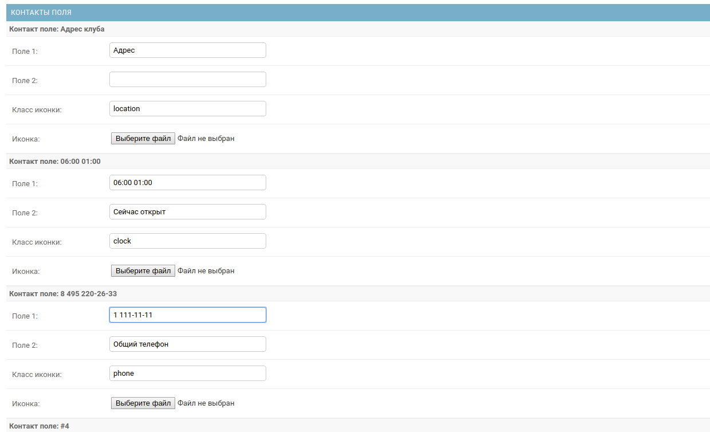

Контакты
========
.. image:: ../_static/contact.png
   :scale: 50 %

.. image:: ../_static/contact_fields.png

Template tags
-------------

    Подключение тега. Если не указать шаблон, то будет взят по умолчанию.
    Если не указан name будут выбраны все записи контактов.

    .. code-block::

       

       

    Изменение шаблона

    .. code-block::

       

    Шаблон для вывода полей контактов и соц. сетей.

    .. code-block:: python

        
{{ contact.name }}

            '''Поля контактов'''
        
            

                
                        '''Иконка'''
                    
                
                        '''Загруженая иконка'''
                    
                
                    '''Поле 1'''
                {{ field.text|safe }}
                    '''Поле 2'''
                {{ field.text_two|safe }}
            

        
            '''Соц. ссылки'''
        
            

                <a href="{{ link_soc.get_link_contact_soc }}">
                    
                            '''Иконка'''
                        
                    
                            '''Загруженая иконка'''
                        
                    
                           ''' Название, если нет иконок'''
                        {{ link_soc.link }}
                    
                </a>
            

        

Поля
----

Поля модели контактов
~~~~~~~~~~~~~~~~~~~~~~
    :name = CharField(max_length=100, default="Контакты"): Название
    :description = TextField(max_length=5000, blank=True, null=True): Описание
    :map = CharField(max_length=10000, blank=True, null=True): Карта
    :slug = SlugField(max_length=100, unique=True): URL

Поля контактов
~~~~~~~~~~~~~~~~~~~~~~
    :text = CharField(max_length=1000, blank=True): Поле 1
    :text_two = CharField(max_length=1000, blank=True): Поле 2
    :icon_ui = CharField(max_length=500, blank=True): Класс иконки
    :icon = FileField(upload_to="icon/", null=True, blank=True): Иконка
    :contact = ForeignKey(Contact, related_name="contact_field", on_delete=models.CASCADE): Связь с моделью Контакты

Поля соц. сети контактов
~~~~~~~~~~~~~~~~~~~~~~
    :contact_soc = ForeignKey(Contact, related_name="soc_net", on_delete=models.CASCADE, null=True, blank=True): Связь с моделью Контакты
    :your_id = CharField(max_length=100, null=True, blank=True): Ваша ссылка
    :link = ForeignKey(SocialNetworks, on_delete=models.CASCADE, null=True, blank=True): Связь с моделью Соц. сеть